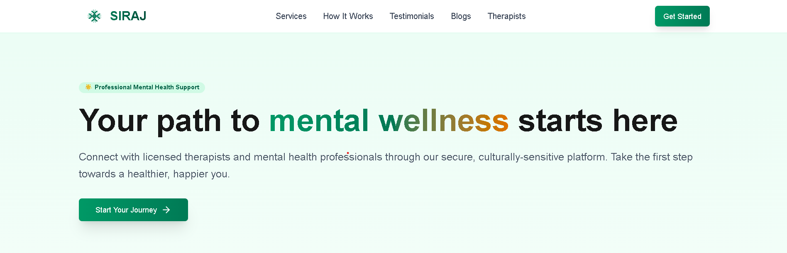

# Siraj Mental Health Platform


## Overview

Siraj is an innovative mental health marketplace platform specifically designed for the Egyptian mental health sector. The platform bridges the gap between licensed psychologists and individuals seeking accessible, affordable, and private online therapy services.

By creating a secure and user-friendly environment, Siraj aims to:

- Improve access to mental health services across Egypt
- Reduce stigma through private, convenient online sessions
- Empower therapists with tools to manage their practice efficiently
- Provide educational resources to raise mental health awareness



## Features

### For Patients

- **Verified Provider Access**: Connect with licensed, thoroughly vetted mental health professionals
- **Advanced Search Capabilities**: Find the right therapist using filters for specialty, gender, price, and availability
- **Seamless Booking System**: Schedule appointments with real-time availability updates
- **Secure Communication**: Participate in encrypted video sessions and messaging
- **Session Management**: Track therapy history and progress over time
- **Educational Resources**: Access professional mental health content tailored to the Egyptian context

### For Therapists

- **Comprehensive Practice Management**: Handle appointments, payments, and clinical notes in one unified system
- **Professional Autonomy**: Set your own pricing, availability, and practice parameters
- **Client Relationship Tools**: Manage ongoing therapeutic relationships with secure communication options
- **Profile Customization**: Create a professional presence that highlights your expertise and approach
- **Streamlined Workflow**: Focus on providing care rather than administrative tasks

## Getting Started

### For Patients

#### 1. Register Your Account

```
- Visit the Siraj website and click "Register as Patient"
- Complete the registration form with your name, email, and phone number
- Verify your email to activate your account
```

#### 2. Complete Your Profile

```
- Add personal information to help match you with the right therapist
- Set your preferences for therapy type and communication
```

#### 3. Find Your Therapist

```
- Use search functionality or browse by specialty
- Filter results by price, language, and availability
- Review therapist profiles, credentials, and patient reviews
```

#### 4. Book and Prepare for Your Session

```
- Select your preferred therapist and click "Book Session"
- Choose an available time slot and complete payment
- Join the session via the provided Zoom link at the scheduled time
```

### For Psychologists

#### 1. Professional Registration

```
- Select "Register as Psychologist" on the Siraj website
- Provide your professional details and upload license certificates
- Wait for verification by our admin team (typically 24-48 hours)
```

#### 2. Build Your Professional Profile

```
- Add your specializations and areas of expertise
- Set your session pricing
- Upload professional photos and write a compelling bio
```

#### 3. Manage Your Schedule

```
- Use the calendar dashboard to set your availability
- Block off times when you're unavailable
- Receive notifications for new bookings
```

#### 4. Conduct Sessions

```
- Review patient information before sessions
- Join secure video sessions at scheduled times
- Take private session notes
- Mark sessions as completed to update your records
```


## Technical Architecture

Siraj is built using modern web technologies:

- **Frontend**: React with Next.js for server-side rendering and optimal performance
- **Backend**: TypeScript-based API services using Nest.js
- **Database**: PostgreSQL for relational data storage
- **Caching**: Redis for performance optimization
- **Real-time Communication**: WebSocket implementation for chat and notifications
- **Video Sessions**: Integration with secure third-party video conferencing services
- **Payment**: Integration with Paymob for handling secure payment and refunds

## Project Status

The Siraj Mental Health Platform is currently **Active** and under continuous development. We regularly deploy updates to improve functionality and user experience based on feedback from both therapists and patients.

## Contributing

We welcome contributions from developers, mental health professionals, and users who want to improve the platform. Here's how you can contribute:

1. **Report Issues**: If you encounter any bugs or have feature suggestions, please open an issue
2. **Submit Pull Requests**: Code contributions are welcome for open issues
3. **Documentation**: Help improve our guides and documentation
4. **Feedback**: Share your experience using the platform to help us improve

## License

This project is licensed under the MIT License.


## 🚀 Demo

Check out the demo video: [Siraj Demo Video Link](https://your-demo-url.com)

#
<p align="center">
  
  <br>
  <i>Siraj - Making mental healthcare accessible for everyone</i>
</p>
